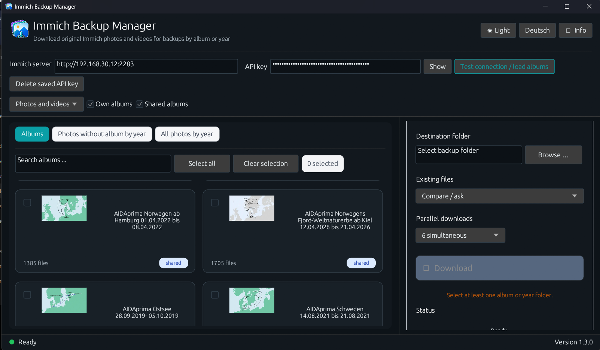
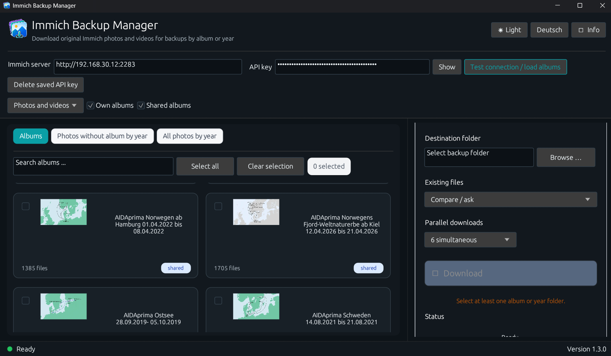
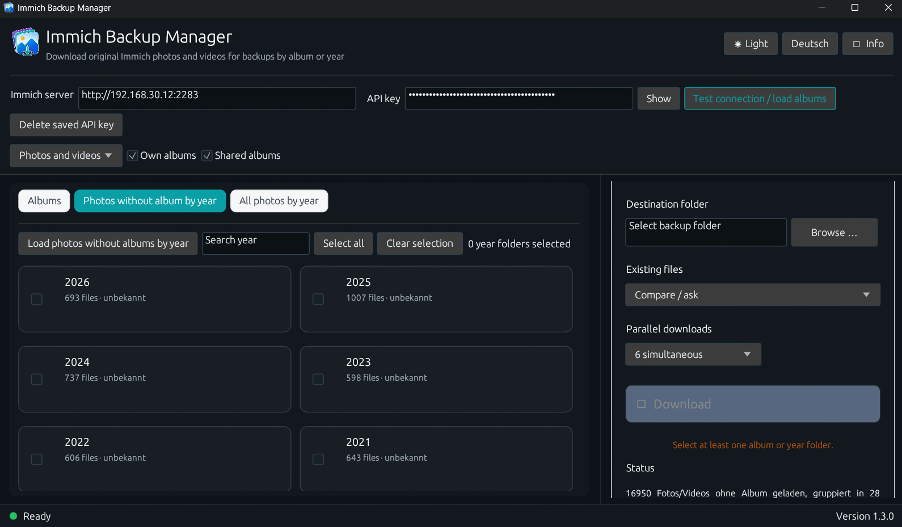
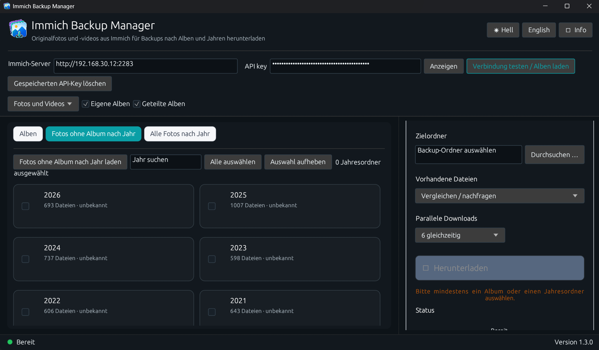
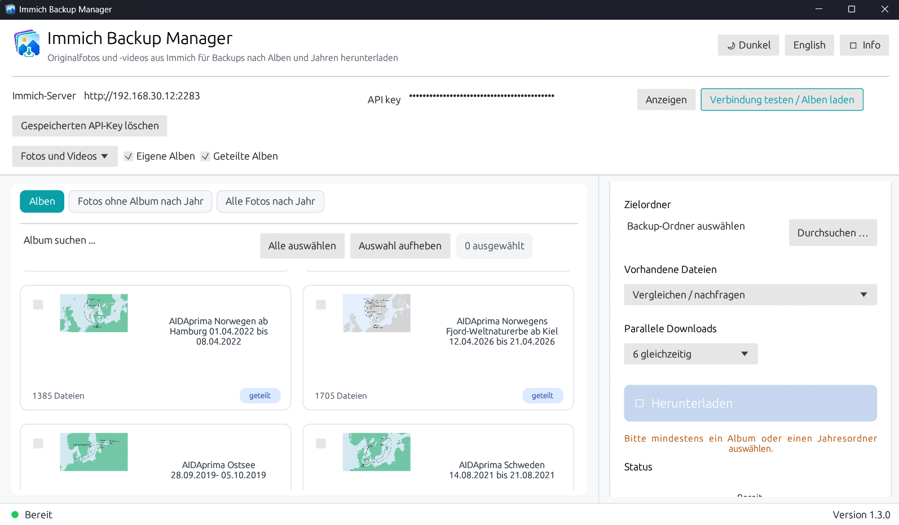
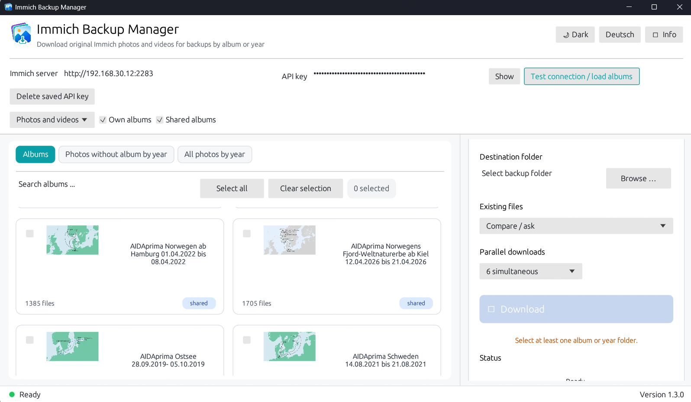
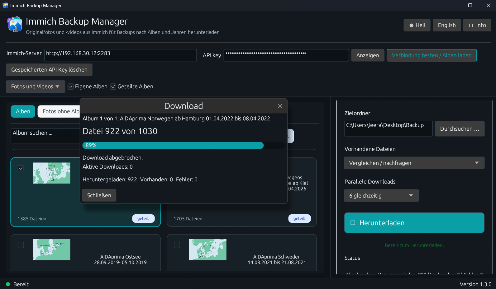
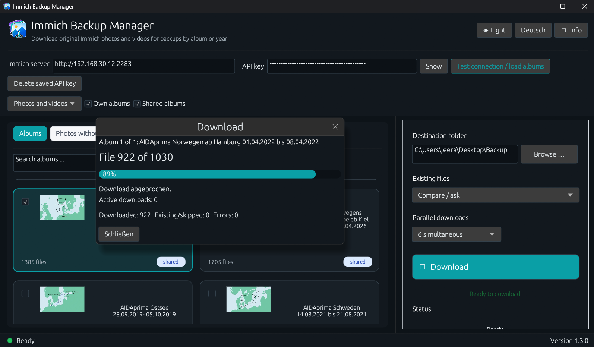

# Immich Backup Manager

**Version 1.3.3 · Windows · Deutsch & English · Freeware**

Der **Immich Backup Manager** lädt Originalfotos und Originalvideos aus einer eigenen Immich-Installation herunter. Unterstützt werden vollständige Alben, Fotos ohne Album nach Jahr sowie alle Fotos nach Jahr. Bereits vorhandene Dateien können übersprungen, überschrieben oder in einem eigenen Vergleichsfenster geprüft werden.

The **Immich Backup Manager** downloads original photos and videos from a self-hosted Immich installation. It supports complete albums, photos without albums grouped by year, and all photos grouped by year. Existing files can be skipped, overwritten, or reviewed in a dedicated comparison window.

> Dieses Projekt ist ein unabhängiges Werkzeug und steht in keiner Verbindung zum offiziellen Immich-Projekt.  
> This project is an independent utility and is not affiliated with the official Immich project.

---

## Screenshots / Screenshots

### Dark Mode – Alben / Albums





### Dark Mode – Jahresansicht / Year view





### Light Mode / Light mode





### Download-Fortschritt / Download progress





---

# Deutsch

## Funktionen

- Verbindung mit einem eigenen Immich-Server per Serveradresse und API-Schlüssel
- Download eigener und geteilter Alben
- Download von Fotos und Videos ohne Album, gruppiert nach Jahr
- Download aller Fotos und Videos, gruppiert nach Jahr
- Auswahl mehrerer Alben oder Jahresordner
- Speicherung der Originaldateien ohne zusätzliches ZIP-Archiv
- Parallele Downloads mit einstellbarer Anzahl gleichzeitiger Übertragungen
- Fortschrittsanzeige mit Album-, Datei-, Fehler- und Statusinformationen
- Abbruch laufender Downloads
- Mit Windows DPAPI verschlüsselte lokale Speicherung des API-Schlüssels mit Löschfunktion
- Vergleich bereits vorhandener Dateien
- Automatisches Überspringen vollständig vorhandener Dateien
- Wahlweise direktes Überschreiben
- Duplikatverwaltung in einem eigenen Fenster
- Gleich große Vergleichsboxen und Vorschaubereiche
- Korrekte Ausrichtung lokaler Bildvorschauen anhand der EXIF-Daten
- Deutsche und englische Benutzeroberfläche
- Dark Mode und Light Mode
- Neues hochauflösendes Programmsymbol und längliches Kopfzeilenlogo
- Windows-Programmsymbol und grafische Benutzeroberfläche

## Funktionsweise

### Alben

Ausgewählte Immich-Alben werden vollständig heruntergeladen. Für jedes Album wird im Zielordner ein eigener Ordner mit dem Albumnamen erstellt.

### Fotos ohne Album nach Jahr

Fotos und Videos, die keinem Album zugeordnet sind, werden nach Aufnahmejahr gruppiert und in Jahresordnern gespeichert.

### Alle Fotos nach Jahr

Alle in Immich vorhandenen Fotos und Videos werden unabhängig von ihrer Albumzuordnung nach Aufnahmejahr gruppiert heruntergeladen.

### Vorhandene Dateien

Im Modus **Vergleichen / nachfragen** prüft das Programm vorhandene Dateien. Unterschiedliche Versionen werden in der Duplikatverwaltung gegenübergestellt. Dort werden – soweit verfügbar – Vorschau, Dateiname, Aufnahmezeit, Dateigröße, Auflösung und Speicherort angezeigt.

Im Modus **Direkt überschreiben** werden vorhandene Dateien ohne weitere Nachfrage ersetzt. Bereits vollständig vorhandene Dateien können automatisch übersprungen werden.

### Datenschutz

Der API-Schlüssel wird mit Windows DPAPI verschlüsselt und nur lokal im Windows-Benutzerprofil gespeichert:

```text
%APPDATA%\Immich_Backup_Manager\settings.json
```

Die verschlüsselte Speicherung ist an das aktuelle Windows-Benutzerkonto gebunden. Ein vorhandener Klartext-Schlüssel aus Version 1.3.1 wird beim ersten Start automatisch in das DPAPI-Format migriert. Der gespeicherte API-Schlüssel kann jederzeit im Programm gelöscht werden. Das Programm überträgt den API-Schlüssel nicht an den Entwickler oder an fremde Server. Die Verbindung erfolgt ausschließlich zu der vom Benutzer eingetragenen Immich-Adresse.

## Voraussetzungen

- Windows 10 oder Windows 11
- Erreichbare Immich-Installation
- Gültiger Immich-API-Schlüssel
- Schreibzugriff auf den ausgewählten Zielordner

## Verwendung

1. Immich-Serveradresse eintragen.
2. API-Schlüssel eintragen.
3. **Verbindung testen / Alben laden** auswählen.
4. Alben oder Jahresordner auswählen.
5. Zielordner festlegen.
6. Verhalten für vorhandene Dateien auswählen.
7. Anzahl paralleler Downloads festlegen.
8. **Herunterladen** starten.

## Build unter Windows

1. Rust über `rustup` installieren.
2. Repository klonen oder herunterladen.
3. `BUILD.cmd` ausführen.
4. Die fertige Datei befindet sich anschließend als `Immich Backup Manager.exe` im Projektordner beziehungsweise unter `target\release`.

Alternativ:

```powershell
cargo build --release
```

## GitHub Actions

Bei jedem Push und Pull Request wird das Projekt unter Windows geprüft und als Release-Build kompiliert. Das erzeugte Windows-Programm wird als Workflow-Artefakt bereitgestellt. Ein Tag im Format `v1.3.3` startet zusätzlich den Release-Workflow.

## Wichtiger Backup-Hinweis

Nach jeder größeren Sicherung sollte geprüft werden, ob die erwarteten Dateien vollständig vorhanden und lesbar sind. Das Programm ersetzt kein zusätzliches, regelmäßig geprüftes Backup-Konzept.

---

# English

## Features

- Connects to a self-hosted Immich server using a server address and API key
- Downloads personal and shared albums
- Downloads photos and videos without an album, grouped by year
- Downloads all photos and videos, grouped by year
- Supports selecting multiple albums or year folders
- Stores original files without an additional ZIP archive
- Parallel downloads with a selectable number of simultaneous transfers
- Progress display with album, file, error, and status information
- Cancels running downloads
- Stores the API key locally using Windows DPAPI encryption and allows it to be deleted
- Compares existing files
- Automatically skips files that are already complete
- Optional direct overwrite mode
- Duplicate management in a dedicated window
- Equal-sized comparison panels and preview areas
- EXIF orientation correction for local previews
- German and English interface
- Dark mode and light mode
- New high-resolution program icon and horizontal header logo
- Windows application icon and graphical user interface

## How it works

### Albums

Selected Immich albums are downloaded completely. A separate folder using the album name is created in the destination directory.

### Photos without an album by year

Photos and videos that are not assigned to an album are grouped by capture year and stored in matching year folders.

### All photos by year

All photos and videos in Immich are downloaded and grouped by capture year, regardless of album membership.

### Existing files

In **Compare / ask** mode, the application checks existing files. Different versions are displayed side by side in the duplicate manager. Where available, it shows the preview, filename, capture time, file size, resolution, and storage location.

In **Direct overwrite** mode, existing files are replaced without further confirmation. Files that are already complete can be skipped automatically.

### Privacy

The API key is encrypted with Windows DPAPI and stored only in the local Windows user profile:

```text
%APPDATA%\Immich_Backup_Manager\settings.json
```

The encrypted value is bound to the current Windows user account. A plaintext key saved by version 1.3.1 is automatically migrated to DPAPI format on first start. The saved API key can be deleted from within the application at any time. The program does not transmit the API key to the developer or to third-party servers. It connects only to the Immich address entered by the user.

## Requirements

- Windows 10 or Windows 11
- Reachable Immich installation
- Valid Immich API key
- Write access to the selected destination folder

## Usage

1. Enter the Immich server address.
2. Enter the API key.
3. Select **Test connection / load albums**.
4. Select albums or year folders.
5. Choose the destination folder.
6. Select how existing files should be handled.
7. Select the number of parallel downloads.
8. Start **Download**.

## Build on Windows

1. Install Rust using `rustup`.
2. Clone or download the repository.
3. Run `BUILD.cmd`.
4. The finished file is created as `Immich Backup Manager.exe` in the project folder or under `target\release`.

Alternatively:

```powershell
cargo build --release
```

## GitHub Actions

Every push and pull request checks the project on Windows and creates a release build. The Windows executable is uploaded as a workflow artifact. A tag in the format `v1.3.3` additionally starts the release workflow.

## Important backup notice

After every major backup, verify that the expected files are present and readable. This application does not replace an additional, regularly tested backup strategy.

---

## Versionsverlauf / Version history

Siehe [CHANGELOG.md](CHANGELOG.md).  
See [CHANGELOG.md](CHANGELOG.md).

## Lizenz / License

Dieses Projekt verwendet eine eigene Freeware-Lizenz. Der Quellcode ist öffentlich einsehbar, aber nicht als Open-Source-Lizenz zur freien Veränderung und Weiterverbreitung freigegeben. Maßgeblich ist ausschließlich die Datei [LICENSE](LICENSE).

This project uses a custom freeware license. The source code is publicly visible, but it is not released under an open-source license that permits unrestricted modification and redistribution. Only the [LICENSE](LICENSE) file is legally authoritative.

**Copyright © 2026 Ralf Ebert. Alle Rechte vorbehalten. / All rights reserved.**
