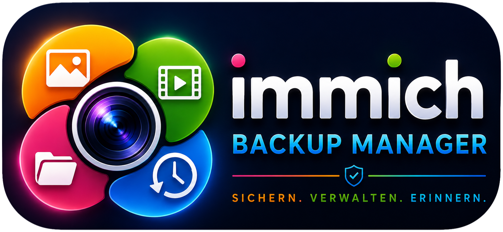
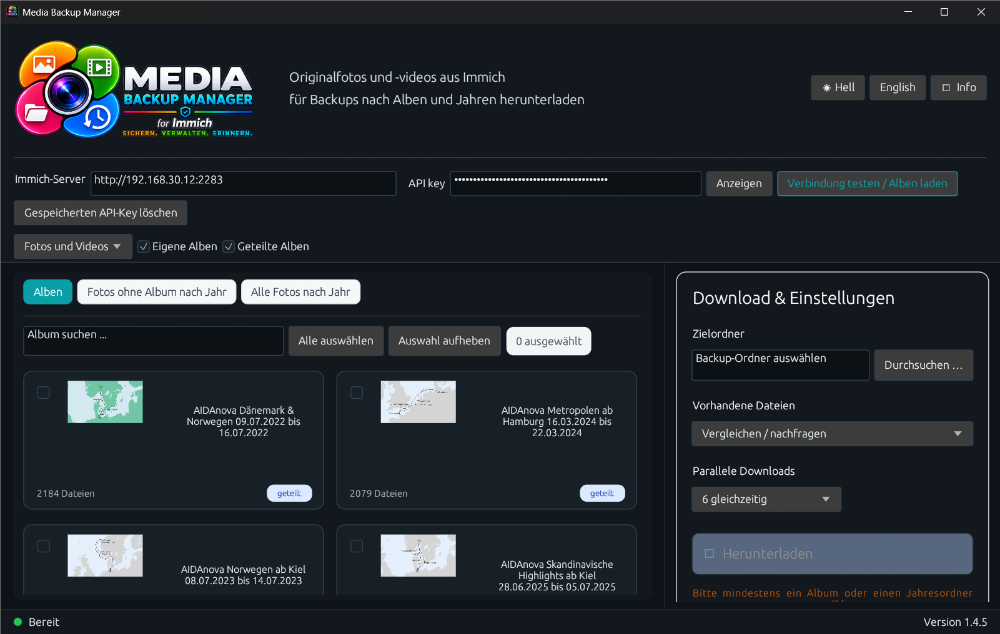
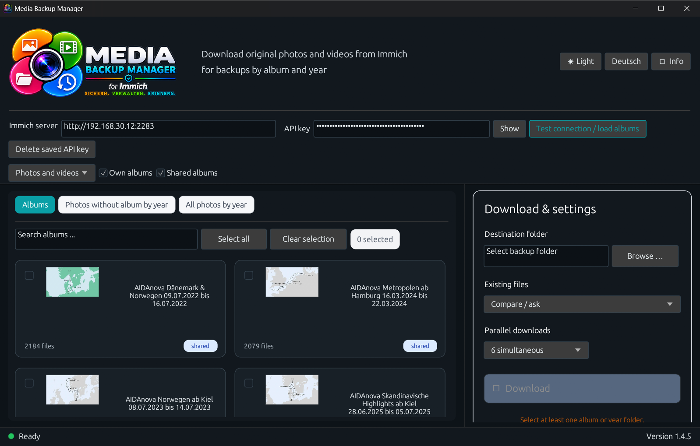
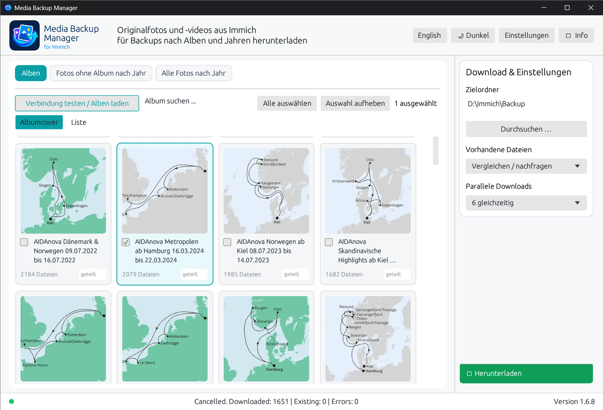
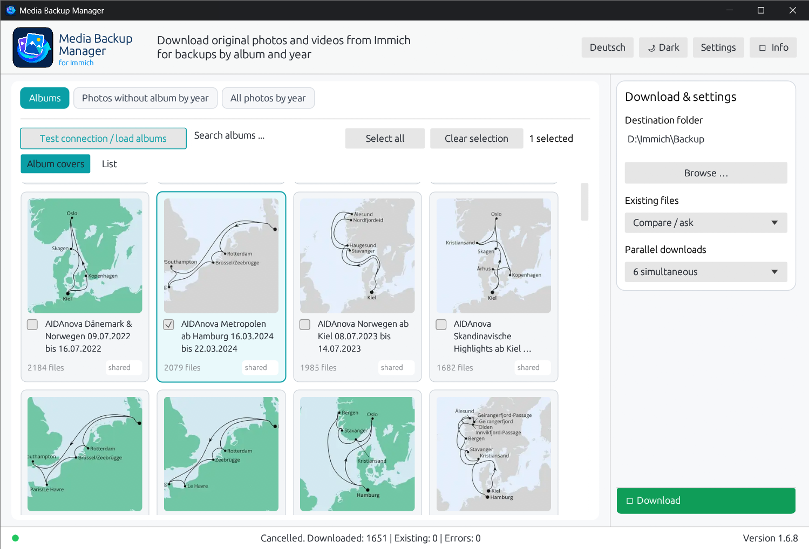
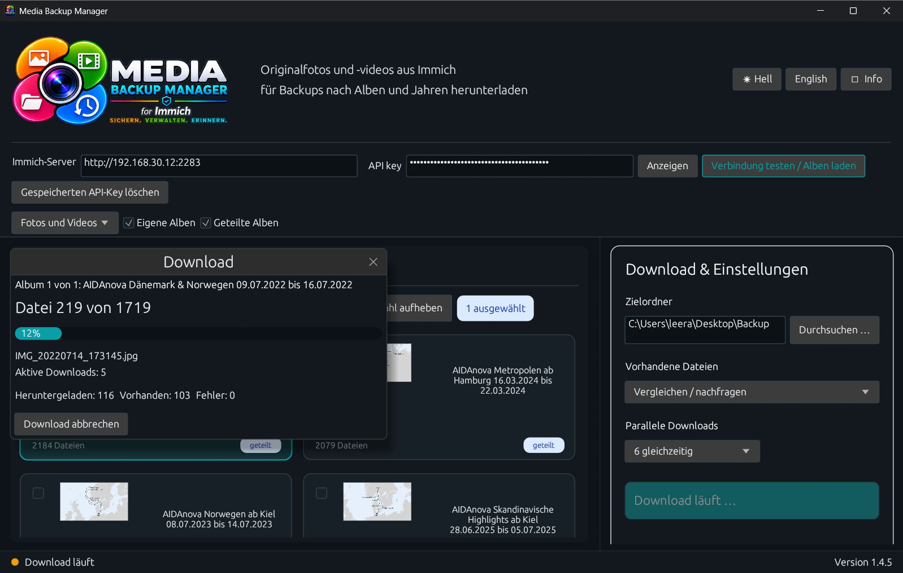
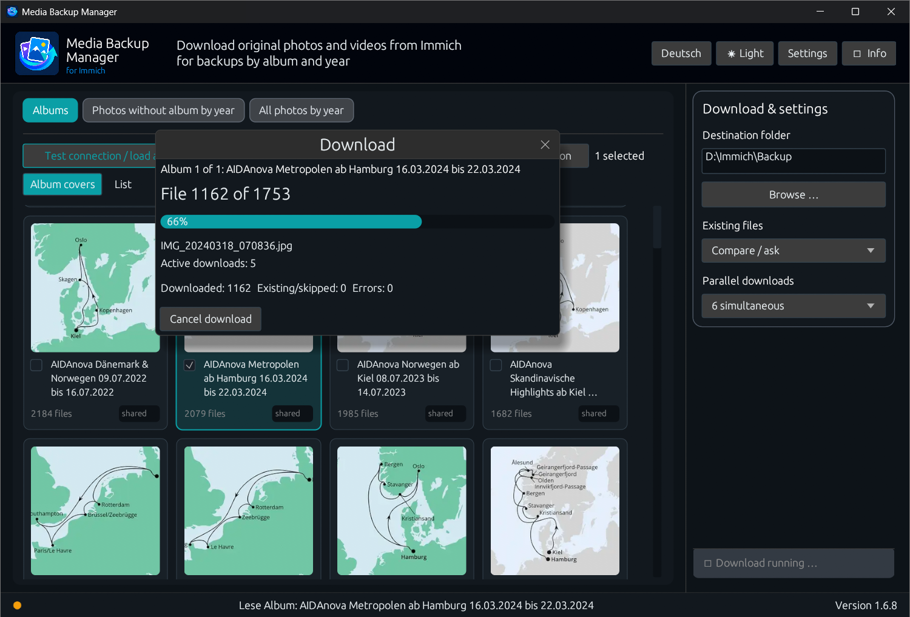

# Media Backup Manager

<p align="center">
  
</p>

<p align="center">
  <strong>A Windows backup manager for Immich.</strong><br>
  <strong>Sichern, verwalten und wiederherstellen von Immich-Foto- und Videobibliotheken.</strong>
</p>

<p align="center">
  <a href="#english">English</a> · <a href="#deutsch">Deutsch</a> ·
  <a href="CHANGELOG.md">Changelog</a> · <a href="RELEASE_NOTES.md">Release notes</a> ·
  <a href="LICENSE">License</a>
</p>

> **Version 1.6.2 · Windows · Rust + egui · Freeware**  
> **Freeware · Copyright © 2026 Ralf Ebert · All rights reserved.**  
> Independent third-party utility for Immich — not an official Immich or FUTO product.

---

## Screenshots / Vorschaubilder

### Dark Mode – Albums / Alben

| Deutsch | English |
|---|---|
|  |  |

### Light Mode – Albums / Alben

| Deutsch | English |
|---|---|
|  |  |

### Download progress / Download-Fortschritt

| Deutsch | English |
|---|---|
|  |  |

---

<a id="english"></a>
# English

## Overview

**Media Backup Manager** is an independent Windows application for downloading and backing up original photos and videos from a self-hosted Immich installation. It supports complete albums, media without an album grouped by year, and all media grouped by year. Existing files can be skipped, overwritten, or reviewed in a dedicated comparison window.

## Features

- Connect to a self-hosted Immich server using its address and an API key
- Download personal and shared albums
- Download photos and videos without an album, grouped by year
- Download all photos and videos, grouped by year
- Select multiple albums or year folders
- Store original files without an additional ZIP archive
- Parallel downloads with a selectable number of simultaneous transfers
- Fixed Download & Settings sidebar
- Download button integrated into the main view row
- Fixed mathematical album-card grid with up to 6 columns
- Strict clipping of album-card content inside the visible scroll area
- Download protocol window after completed downloads
- Progress display with file, album, error, and status information
- Compare existing local files with Immich files
- Automatically skip files that are already complete
- Optional direct overwrite mode
- Duplicate management in a dedicated window
- Correctly orient local image previews based on EXIF metadata
- German and English interface
- Dark mode and light mode
- Windows DPAPI encryption for the stored Immich API key

## API-key encryption and migration

The Immich API key is stored locally using **Windows Data Protection API (DPAPI)** encryption. The encrypted value is tied to the current Windows user account.

Current settings location:

```text
%APPDATA%\Media_Backup_Manager\settings.json
```

When version 1.6.2 is started for the first time, existing settings from the previous application name are detected and migrated automatically where possible.

## Usage

1. Enter the Immich server address.
2. Enter the API key.
3. Select **Test connection / load albums**.
4. Select albums or year folders.
5. Choose the destination folder.
6. Select how existing files should be handled.
7. Select the number of parallel downloads.
8. Start **Download**.

## Build on Windows

1. Install Rust using `rustup`.
2. Clone or download the repository.
3. Run `BUILD.cmd`.
4. The finished executable is created as `Media Backup Manager.exe`.

Alternatively:

```powershell
cargo build --release
```

---

<a id="deutsch"></a>
# Deutsch

## Überblick

**Media Backup Manager** ist eine eigenständige Windows-Anwendung zum Herunterladen und Sichern der originalen Fotos und Videos aus einer selbst gehosteten Immich-Installation. Unterstützt werden vollständige Alben, Medien ohne Album nach Jahren sowie alle Medien nach Jahren. Bereits vorhandene Dateien können übersprungen, überschrieben oder in einem eigenen Vergleichsfenster geprüft werden.

## Funktionen

- Verbindung mit einem selbst gehosteten Immich-Server über Serveradresse und API-Key
- Persönliche und geteilte Alben herunterladen
- Fotos und Videos ohne Album nach Jahren herunterladen
- Alle Fotos und Videos nach Jahren herunterladen
- Mehrere Alben oder Jahresordner gleichzeitig auswählen
- Originaldateien direkt speichern, ohne zusätzliches ZIP-Archiv
- Parallele Downloads mit einstellbarer Anzahl gleichzeitiger Übertragungen
- Feste Seitenleiste **„Download & Einstellungen“**
- Download-Schaltfläche direkt in der Hauptansichtszeile
- Mathematisch festes Albumkarten-Raster mit bis zu 6 Spalten
- Automatische Anpassung der Spaltenzahl an die verfügbare Fensterbreite
- Gleichmäßige Kartenbreiten sowie feste horizontale und vertikale Abstände
- Striktes Clipping aller Albumkarten-Inhalte innerhalb des sichtbaren Scrollbereichs
- Kein Überzeichnen von Albumtiteln, Vorschaubildern oder Karteninhalten beim Scrollen
- Protokollfenster nach abgeschlossenem Download
- Fortschrittsanzeige mit Datei-, Album-, Fehler- und Statusinformationen
- Vorhandene lokale Dateien mit Immich-Dateien vergleichen
- Bereits vollständig vorhandene Dateien automatisch überspringen
- Optional vorhandene Dateien direkt überschreiben
- Duplikatverwaltung in einem eigenen Fenster
- Lokale Bildvorschauen anhand der EXIF-Ausrichtung korrekt darstellen
- Deutsche und englische Benutzeroberfläche
- Dark Mode und Light Mode
- Verschlüsselte Speicherung des Immich-API-Keys über Windows DPAPI

## API-Key-Verschlüsselung und Migration

Der Immich-API-Key wird lokal mit der **Windows Data Protection API (DPAPI)** verschlüsselt gespeichert. Der verschlüsselte Wert ist an das aktuell verwendete Windows-Benutzerkonto gebunden.

Aktueller Speicherort der Einstellungen:

```text
%APPDATA%\Media_Backup_Manager\settings.json
```

Beim ersten Start von Version 1.6.2 werden vorhandene Einstellungen aus dem früheren Programmnamen nach Möglichkeit automatisch erkannt und übernommen.

## Verwendung

1. Immich-Serveradresse eingeben.
2. API-Key eingeben.
3. **Verbindung testen / Alben laden** auswählen.
4. Gewünschte Alben oder Jahresordner auswählen.
5. Zielordner festlegen.
6. Festlegen, wie mit bereits vorhandenen Dateien umgegangen werden soll.
7. Anzahl der parallelen Downloads auswählen.
8. **Download** starten.

## Unter Windows bauen

1. Rust über `rustup` installieren.
2. Repository klonen oder herunterladen.
3. `BUILD.cmd` ausführen.
4. Die fertige Anwendung wird als `Media Backup Manager.exe` erstellt.

Alternativ:

```powershell
cargo build --release
```

---

## Immich / Trademark Notice

Media Backup Manager is an independent third-party application for Immich.

This project is **not affiliated with, endorsed by, or sponsored by Immich or FUTO**.  
Immich and related trademarks are the property of their respective owners.

Media Backup Manager is an independent project and is not an official Immich application.

### Hinweis zu Immich / Markenhinweis

Media Backup Manager ist eine unabhängige Drittanbieter-Anwendung für Immich und kein offizielles Produkt von Immich oder FUTO.

Das Projekt steht **in keiner Verbindung zu Immich oder FUTO und wird von diesen weder unterstützt noch gesponsert**.  
Immich und die zugehörigen Marken sind Eigentum ihrer jeweiligen Rechteinhaber.

Media Backup Manager ist ein unabhängiges Projekt und keine offizielle Immich-Anwendung.

---

## License / Lizenz

This project uses a custom freeware license. Only [LICENSE](LICENSE) is legally authoritative.  
Dieses Projekt verwendet eine eigene Freeware-Lizenz. Rechtlich maßgeblich ist ausschließlich [LICENSE](LICENSE).

**Copyright © 2026 Ralf Ebert. All rights reserved. / Alle Rechte vorbehalten.**
